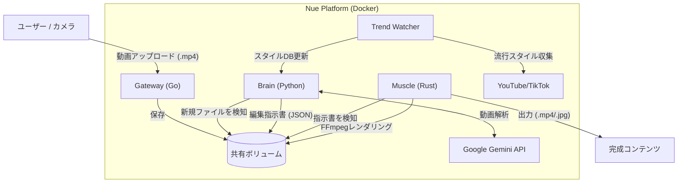

# Nue (鵺) - AI Video Alchemy Platform 🧪


**Nue (鵺)** は、撮影したままの未編集動画を、AIの力で自動的に「YouTubeクオリティ」のコンテンツに変換・錬成する動画処理プラットフォームです。
Go言語の高速性、Google Gemini 2.5の認知能力、そしてRust (FFmpeg) の処理能力を組み合わせることで、クリエイターを「編集作業というボトルネック」から解放します。

---

## 📖 The "Why"
動画制作において、編集作業は最大の障壁です。
- **課題**: たった10分の動画を作るために、カット割り、テロップ入れ、音響調整に2時間以上かかることも珍しくありません。
- **解決策**: Nueは、あなたの専属「AI編集者」として機能します。動画の内容（面白いシーン、真面目なシーン、衝撃的な瞬間）を理解し、BGMの選定、デジタルズームによる演出、さらにはショート動画用の縦型クロップまでを全自動で行います。

## 🚀 Key Features

### 🧠 トレンド分析 & 演出 (Brain)
- **スタイルクローニング**: YouTubeやTikTokで流行しているVlogのスタイル（テンポ、フィルター、音楽）を分析し、学習します。
- **セマンティック分析**: **Gemini 2.5 Flash** を使用し、単なる映像の変化だけでなく「何が起きているか」という文脈を理解して編集します。
- **AIサムネイル**: 動画の中から最もクリック率が高そうな（Clickbaityな）瞬間を特定し、キャッチーなタイトルを入れたサムネイルを自動生成します。

### 💪 高速レンダリング (Muscle)
- **Rust + FFmpeg**: Rustによる並行処理アーキテクチャで、複雑なFFmpegフィルタグラフを効率的に構築・実行します。
- **ビジュアル演出**:
    - **デジタルズーム**: 静止したショットに動きをつける "Ken Burns" エフェクトや、衝撃的な瞬間のインパクトズームを適用します。
    - **スマートクロップ**: 被写体の位置を自動検出し、16:9の動画から9:16のショート動画を切り出します。
- **音響エンジニアリング**:
    - **オートダッキング**: 話し声を検知すると自動的にBGMの音量を下げ、聞き取りやすくします。
    - **ツッコミSE**: 「ここぞ」というタイミングで適切な効果音（笑い声、衝撃音など）を挿入します。

---

## 🛠 Architecture

Nueはマイクロサービスアーキテクチャを採用しており、Docker Composeによるローカル実行に最適化されていますが、AWSやGCPへのデプロイも容易です。



## 💻 Tech Stack

| Service | Technology | Role |
|:---|:---|:---|
| **Gateway** | **Go (Gin)** | 高速・省メモリなアップロード受付サーバー。 |
| **Brain** | **Python 3.11** | AIロジックの中枢。Gemini SDK、ファイル監視、トレンド分析を担当。 |
| **Muscle** | **Rust** | 重量級処理担当。複雑なFFmpegフィルタチェーン（`xfade`, `drawtext`, `sidechaincompress`）を生成・実行。 |
| **Infra** | **Docker Compose** | 全サービスと共有ボリューム（`/data`）のオーケストレーション。 |

---

## ⚡ Quick Start

### 前提条件
- Docker Desktop
- Google Gemini API Key

### インストール手順

1. **リポジトリのクローン**
   ```bash
   git clone https://github.com/naki0227/nue.git
   cd nue
   ```

2. **環境設定**
   `.env` ファイルを作成し、APIキーを設定します:
   ```bash
   GEMINI_API_KEY=your_actual_api_key_here
   GEMINI_MODEL=gemini-2.5-flash
   ```

3. **サービスの起動**
   ```bash
   docker compose up -d --build
   ```

4. **動画の変換**
   `data/raw` ディレクトリに動画ファイルを置くか、以下のコマンドでアップロードします:
   ```bash
   curl -F "file=@/path/to/my_vlog.mp4" http://localhost:8080/upload
   ```

   **もしくは、Web UIを使用:**
   ブラウザで `http://localhost:3000` にアクセスすると、モダンなWebインターフェースからドラッグ＆ドロップでアップロードできます。

5. **結果の確認**
   `data/output/` ディレクトリに、編集済み動画とサムネイルが生成されます！

---

## 📈 Roadmap

- [x] **Phase 1-2**: MVP アーキテクチャ構築 & 基本編集（カット、トランジション）
- [x] **Phase 3**: トレンド分析・学習エンジン
- [x] **Phase 6**: 音響エンジニアリング（ダッキング、SE自動挿入）
- [x] **Phase 7**: ビジュアル演出（ズーム/パン）
- [x] **Phase 8**: サムネイル自動生成
- [x] **Phase 9**: 自動化・品質保証 (GitHub Actions)
- [x] **Phase 10**: 縦型動画対応 (スマートクロップ)
- [x] **Phase 11**: テロップ装飾 (Advanced Caption Styling)
- [x] **Phase 12**: Webインターフェース (Next.js)
- [ ] **Phase 13**: クラウドデプロイ (AWS ECS/Lambda)

---

## 🤝 Contribution

Issueへの報告、Pull Requestをお待ちしています。貢献に関する詳細は `CONTRIBUTING.md` (準備中) をご覧ください。

## 📄 License

本プロジェクトは MIT ライセンスの下で公開されています。詳細は [LICENSE](LICENSE) をご覧ください。
